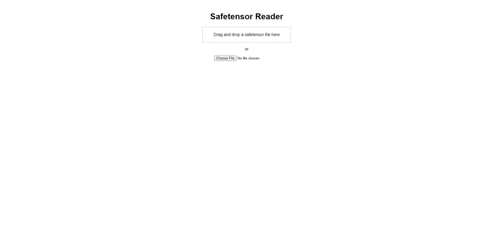

# Lora Keyword Reader


## 📜 Description
**Lora Keyword Reader** is a Python-based tool designed to help users extract trigger words from `.safetensor` files using a simple web interface. Whether you're a machine learning enthusiast or just curious, this tool provides a user-friendly way to delve into your model files.

## 🌟 Features
- **Drag and Drop Interface**: Easily upload your `.safetensor` files.
- **Instant Results**: Get your trigger words in seconds.
- **User-Friendly**: Simple and intuitive UI.

## 🛠️ Installation
To install Lora Keyword Reader, you will need Python installed on your system. Follow these steps:

1. Clone the repository:
    ```sh
    git clone https://github.com/yourusername/lorakeywordreader.git
    cd lorakeywordreader
    ```

2. Create and activate a virtual environment:
    ```sh
    python -m venv lorareader
    call lorareader\Scripts\activate  # For Windows
    source lorareader/bin/activate  # For Unix/MacOS
    ```

3. Install the required dependencies:
    ```sh
    pip install -r requirements.txt
    ```

## 🎬 Usage
To run the program, execute the batch file or the following command in the project directory:
```sh
python lorareader.py

## Contributing
Contributions to the Stable Diffusion Model Space Analyzer are welcome. Please ensure to update tests as appropriate.

## License
This project is licensed under the MIT License - see the LICENSE file for details.

## Acknowledgements
- SixSigmaEngineer for initial development.

## Images

